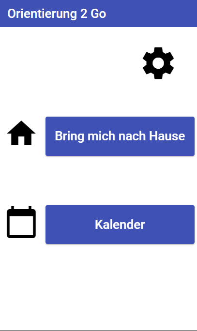
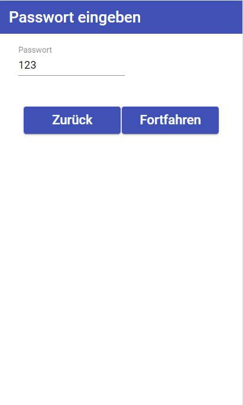
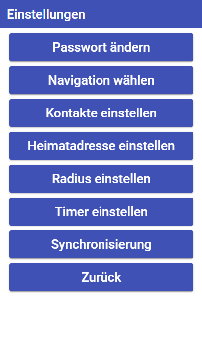
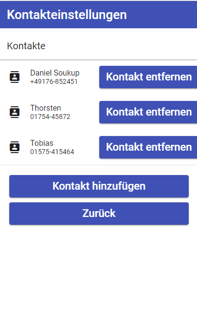
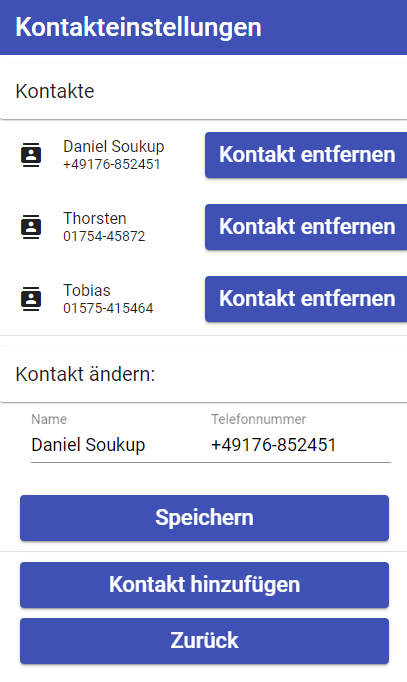
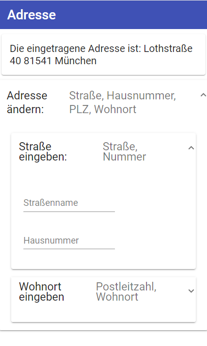
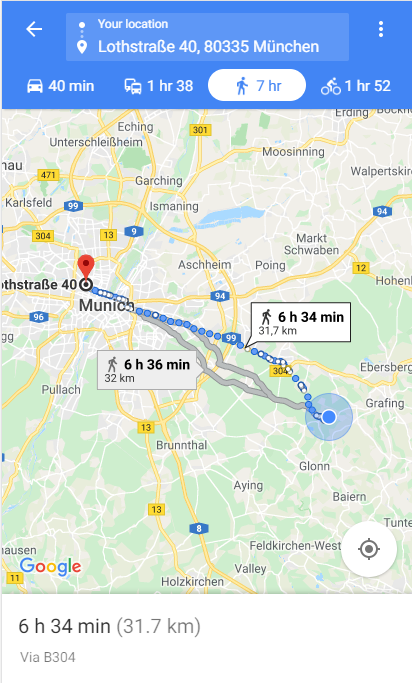
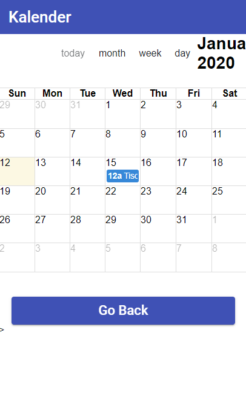

## Challenge Report zu "Orientation 2 Go" 

### Projektkontext 
Dieses Projekt wurde im Rahmen der Veranstaltung "Software Engineering I" im Wintersemester 2019/20 des Bachelorstudiengangs "Informatik" unter der Aufsicht von Prof. Dr. Kofler erstellt. Hierbei war die Alzheimer Gesellschaft München Partner des Projektes. Das Projekt entstand in Form einer sogenannten "Challenge" in Kollaboration mit dem DTLab der Hochschule Münche. Grundlegendes Ziel  ist dabei Demenzbetroffenen oder auch Angehörigen den Alltag mittels technischen Möglichkeiten zu erleichtern.

#### Alzheimer Gesellschaft München 
Die Deutsche Alzheimer Gesellschaft e.V. Selbsthilfe Demenz (DAlzG) engagiert sich seit nun mehr als 30 Jahren für ein besseres Leben mit Demenz. Die Alzheimer Gesellschaft München ist dabei ein Ableger davon. Im Mittelpunkt für die Organisation steht hierbei Wissen über Demenz sowie Beratungs- und Unterstützungsangebote flächendeckend in Deutschland anzubieten. Neben der Aufklärungsarbeit ist die Unterstützung der Betroffenenen in Form von Hilfen zur Selbsthilfe wie auch Möglichkeiten zur Entlastung des Alltags von Angehörigen fundamental wichtig. Zusätzlich stellen sie die Anlaufstelle für ehrenamtliche Helfer dar, die sich besonders engagieren wollen für Menschen mit Demenz. Sei es durch soziale Projekte oder auch finanziell mittels Spenden.
 

#### DTLab 
Das Digital Transformation Lab (DTLab) der Hochschule München in Kooperation mit Amazon Web Services...

- organisiert curricular integrierte Praxisprojekte ("Challenges"), in denen Studierende an Problemen aus dem Bereich der Digitalisierung arbeiten, die von einer Institution des öffentlichen Sektors ("Partner") benannt wurden.

- bietet Studierenden aller Fakultäten die Möglichkeit, wichtige Fähigkeiten im Bereich der Digitalen Transformation zu entwickeln.
verfolgt dabei den Ansatz der Co-Creation, die Partner arbeiten also mit den Studierenden zusammen, um geeignete Lösungen zu entwickeln. Die Ergebnisse werden der Allgemeinheit unter einer Open Source-Lizenz zur Verfügung gestellt.

- ist Teil des Innovationsnetzwerks M:UniverCity , das die Hochschule München mit dem Strascheg Center for Entrepreneurship (SCE) und Partnern aus Wirtschaft, Politik und Gesellschaft betreibt

### Einleitung
Auch wenn der Kontext durch die Kollaborationen durchaus gegeben ist, war am Anfang nicht unbedingt klar, an welcher Stelle man die Hilfe tatsächlich ansetzen kann. Uns wurde weitgehend komplett freigestellt, wie wir denn den Demenzbetroffenen oder -angehörigen helfen wollen, um unserer Kreativität nicht im Wege zu stehen. Grobes Ziel war vor allem mittels technischen Hilfsmittel wie beispielsweise Smartphones den PatientInnen den Alltag zu erleichtern oder auch sonstwie Verantwortung abzunehmen und zu unterstützen. Über den Kontakt mit einem Betroffenenen brachten wir in Erfahrung, dass er selbst mittlerweile alle seine Bedürfnisse gedeckt hat über eine Vielzahl an Apps auf seinem Smartphone.

### Problembeschreibung

Das einzige, was diesen Betroffenenen störte, sei nunmal eben diese große Anzahl an verschiedenen Apps, die er handhaben muss, anstatt einer einzelnen, die er für alles verwenden könnte. Wir hielten es allerdings für fraglich, ob diese Meinung besonders repräsentativ ist, da er doch im Unterschied zu den meisten älteren Menschen einen sehr technikaffinen Eindruck machte. Wie also wollen wir Demenzbetroffenen im Alltag unterstützen?   

### Beschreibung der Idee

Über die Methode der "Crazy Eight", in der jedes Mitglied des Teams über acht Minuten jeweils eine Idee pro Minute niederschreiben muss, kamen einige Ideen zustande. Viele davon - geschuldet des Zeitdrucks - sehr schwierig umsetzbar in den nächsten Jahrzehnten/-hunderten, aber im Mittel war viel davon sehr brauchbar.

Wir entschieden uns im Folgenden für eine Orientierungsapp, die zusätzlich einen Kalender und die Möglichkeit zur Kontaktspeicherung implementiert, sodass wir einerseits viele nützliche Funktionenen in einer App vereinen, aber auch andererseits den Umgang mit der App einfacher gestalten wollten für Menschen, die nicht unbedingt an Technik gewöhnt sind.

Die App soll dem Betroffenenen dabei helfen pünktlich den richtigen Weg zu den eigenen Terminen zu finden. Weiterhin soll die App automatisch erkennen können, falls der Betroffene zu lange außerhalb eines gewissen Radius von seinem Zuhause oder dem Ort seines Termins entfernt ist. Diesen Zustand deklarierten wir als "verloren/orientierungssuchend". Nach einer eingestellten Zeitdauer oder bei Betätigung eines Knopfes in der App "Bring mich nach Hause" soll die App automatisch den Nutzer fragen, ob er derzeit verloren sei und falls ja, wird automatisch eine Route zu seinem voreingestellten Zuhause berechnet und angezeigt.

Gleichzeitig soll die App erkennen, wie lange man zu gespeicherten Terminen unterwegs ist, und soll einen dynamisch rechtzeitig erinnern, sodass man seinen Termin fristgerecht wahrnehmen kann/pünktlich aufbrechen kann.

Zusätzlich hielten wir die Möglichkeit von Kontakten als sinnvoll, da man dort dann bestimmte Angehörige einspeichern kann, die dann als Schnellfenster erreichbar sein können, falls man "verloren" ist und man jemanden anrufen will.

Da man doch eine beachtliche Anzahl an Einstellungen in einer solchen App hat, allerdings die meisten den Betroffenenen verwirren könnten, falls er derzeit sowieso verloren ist und nicht besonders technikaffin ist, entschieden wir uns dafür diese Einstellungen passwortgeschützt zu machen, sodass gegebenenfalls ein Pfleger oder Angehöriger diese Sachen für den Betroffenenen einstellt und der Patient bloß sehr wenige Knöpfe tatsächlich drücken kann.

### Herangehensweise zur Umsetzung

Für dieses Projekt wurde explizit die "Working backwards"-Philosophie von Amazon getestet. Diese wurde im Rahmen der Veranstaltung ausführlich präsentiert. Dementsprechend wurde zu Beginn des Projekts viel Fokus gelegt auf die Sichtweise möglicher Kunde. Dies wurde über die Erstellung von Empathy Maps, Wireframes/Prototyping, User Storys, FAQs und einem Press Release erreicht.
In der tatsächlichen Entwicklungsphase kam dagegen SCRUM zum Einsatz.

### Beschreibung der Lösung

Durch den Mangel an Zeit sind wir leider nicht zu allen Features gekommen, die wir uns vorgestellt haben. Trotzdem haben wir eine beachtliche Menge an Struktur geschaffen, an der man in Zukunft weiterarbeiten kann.

1. Persistenter Speicher der folgenden Einstellungen

     1. Passwortgeschützt
         
         
        
        
        
         
         

     2. Kontakte hinzufügbar, änderbar + löschbar
         
         
        
        
         
         

      3. Heimatadresse speicherbar
          
          
         
          
          
    
      4. Maximaler Entfernungsradius, Timer & Synchronisierungsintervall einstellbar
          
          

2. Ausführbarkeit der App auf Android

3. "Bring mich nach Hause" ruft Google Maps Routenfindung mit Heimatadresse als Argument auf
     
     
    
     
     

4. Etwas ansprechender designed mittels Angular Material

5. Service auf Android, der ohne die App offen zu haben, nach einer Minute automatisch Google Maps Routenfindung  öffnet

6. Grundlegende Implementation des Kalenders
     
     
    
     
     

Neben der erwarteten Einarbeitungszeit in Angular floß auch einiges an Zeit in die Portierung auf das Smartphone, da dies nunmal unser eigentlicher Zielmarkt ist. Da wir uns dafür entschieden die App mittels Angular zu programmieren anstelle direkt in Android zu arbeiten, kam Cordova zum Einsatz, was zu einigen Komplikationen führte, besonders bei dem im Hintergrund laufendem Service. Siehe dazu unser seperates [Cordova Projekt](https://gitlab.lrz.de/swe1ws20192020/g6_2). 

### Weiterführende Dokumente 

| Dokumente | |
|-----------------|:-------------|
| [Press-Release](Press-Release.pdf)    | Fiktionaler Pressebericht mit Eckdaten, wie ein möglicher Release der Applikation auf dem Markt beschrieben werden könnte |
| [Frequently Asked Questions](FAQ.pdf/) | Fragen (und Antworten), die uns vor der eigentlichen Implementation aus Sicht eines möglichen Kunden gekommen sind, und die unsere Implementation maßgeblich beeinflusst haben|
| [User Storys](/User-Storys-G6.pdf) | Beispielhafte Geschichten, für welche Arten an Menschen und in welchem Kontext diese App hilfreich sein könnte       |
| [Wireframes](/Wireframe-G6.pptx/) | Anfängliche Demonstration eines Prototypen unser Applikation über Powerpoint Darstellung  |

### Nächste Schritte 
Das Projekt wird zunächst als Open Source veröffentlicht. In der nahen Zukunft könnten beispielhafte Richtungen zur Weiterentwicklung das Geofencing sein, sodass die App im Hintergrund laufend mitbekommt, wenn man den gegebenen Radius verlässt und entsprechend ein Timer gestartet wird oder auch einfach der Kalender, aber auch andere Kleinigkeiten etwas ansprechender zu gestalten, sodass man einige Features auch schön handhabbar für einen Betroffenen macht. Danach könnte man diese Teilbereiche verknüpfen, um alle Vorteile abschöpfen zu können, diese Features gesammelt in einer App zu haben.  

### Zusammenfassung 
In den vergangenen sechs Wochen Sprints wurde ein ordentliches Fundament für unsere Innovation kreiert. Über diesen Prototypen lässt sich nun gut über weitere Schritte reden und mögliche weitere Features anknüpfen. 
Unser Team bestehend aus Manuel Eberhar, Daniel Soukup, Tobias Karius und Thorsten Schartel bedankt sich an dieser Stelle für diese Challenge, die Chance mit dem DTLab wie auch mit der Alzheimer Gesellschaft München zusammenzuarbeiten und an etwas arbeiten zu dürfen, was hoffentlich Menschen in der Zukunft helfen wird.
